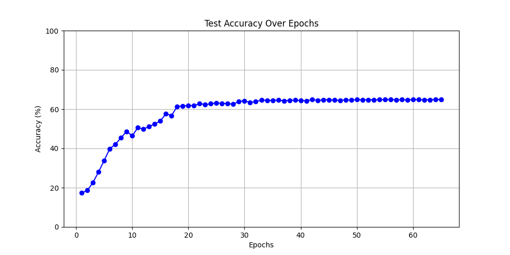

## README

----

This code implements the network architecture described in the paper [**Network In Network**](https://arxiv.org/abs/1312.4400).

We utilize SGD as our optimizer and implement learning rate decay using the `ReduceLROnPlateau` function provided by PyTorch.

Unfortunately, we were unable to achieve the accuracy reported in the original paper, possibly due to setting the patience period too small.

Training details are recorded in `logs.txt`.

### Dataset

----

+ Cifar10

### Result

**Accuracy**: **60%**

