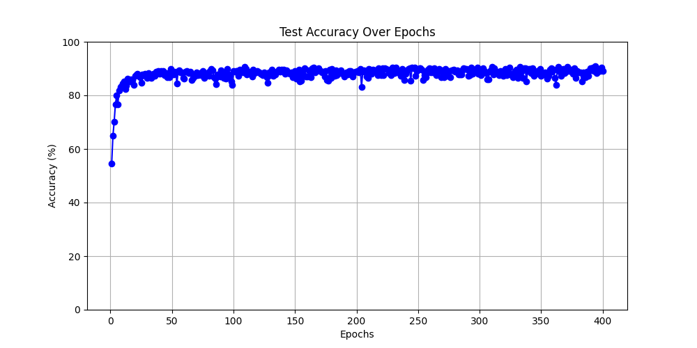

## README

----

This code implements the network architecture described in the paper [**Going Deeper with Convolutions**](https://arxiv.org/abs/1409.4842).

In this implementation, we utilize batch normalization to enhance performance.

### Dataset

----

+ Cifar10

### Result

----

logs.txt: Contains the training process details.

**Accuracy**: **90.81%** (without learning rate range decay)

**Accuracy**: **94%** (with learning rate range decay)

.png)