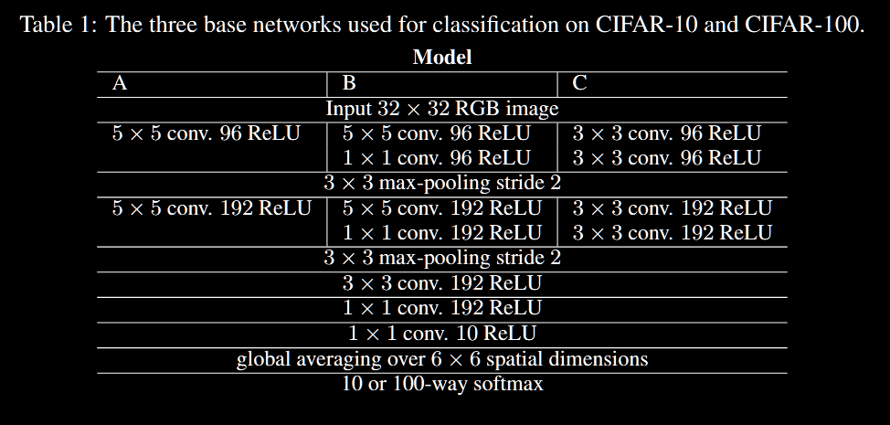
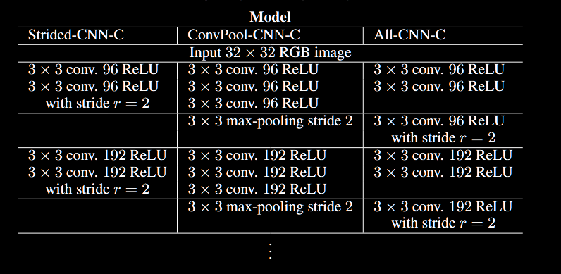
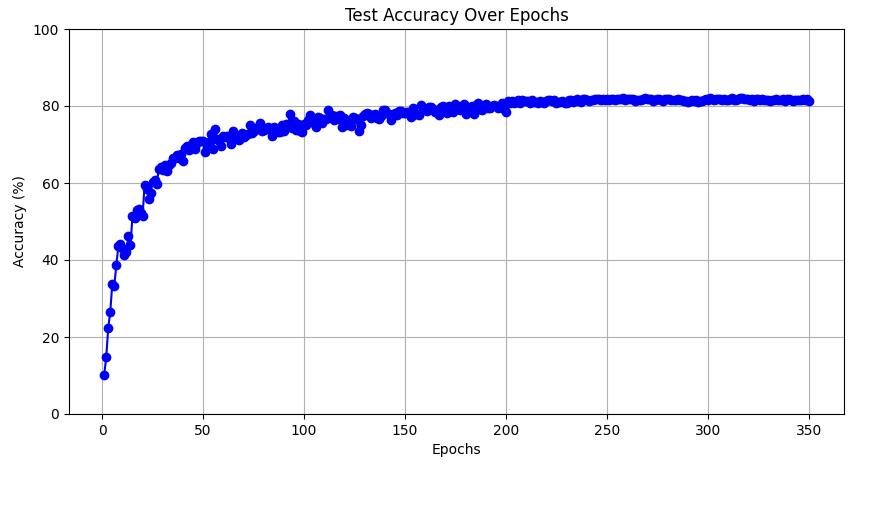
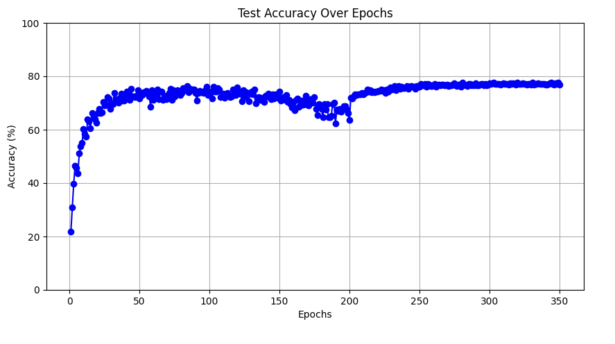
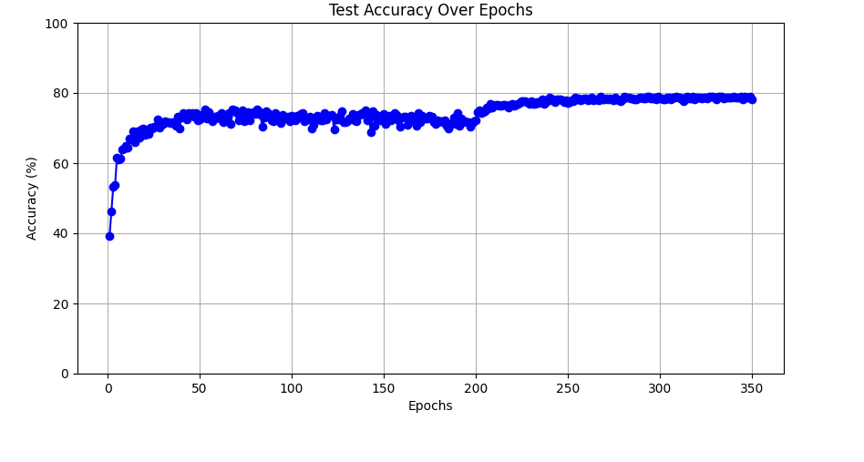

### README

----

This is used to implement the code of the paper: [[1412.6806\] Striving for Simplicity: The All Convolutional Net](https://arxiv.org/abs/1412.6806)

We have just finished implementing the base model C and the All CNN C.

We set the weight decay to $1e−6$ and applied padding of **1** for all convolution layers except for the last convolution layer, which differs from the original paper.

#### Dataset

----

+ CIFAR-10
+ CIFAR-100

#### Model Architecture

----

##### Base Model

##### All CNN

#### Result

-----

Somehow, we could not achieve the performance that others have reported.

1. When we set the batch size to 128, we achieved an accuracy of **81.37%** for the All CNN model.

2. When we set the batch size to 32, we obtained an accuracy of **77.07%** for the All CNN model.

3. For the base model, we achieved an accuracy of **78.90%** with a batch size of 32.

