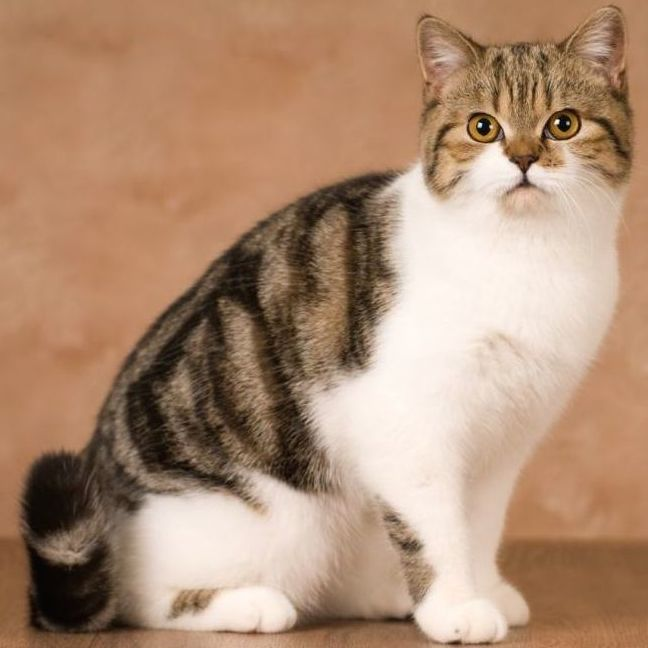
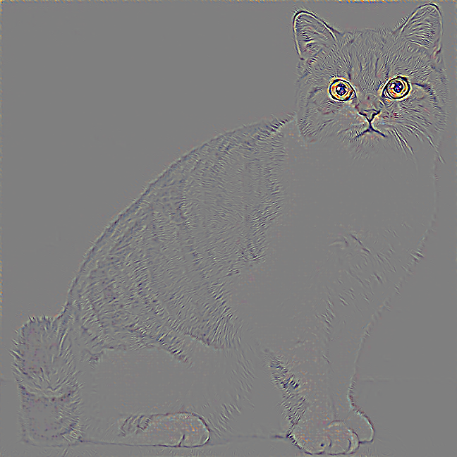

### README

----

This code is used to implement the methods described in the paper: [Striving for Simplicity: The All Convolutional Net](https://arxiv.org/abs/1412.6806).

We have completed the section on guided backpropagation.

For demonstration, we use a pre-trained ResNet-50 model, but you can pass your own model to the function.

We have rebuilt the code from [jacobgil/pytorch-grad-cam: Advanced AI Explainability for Computer Vision, supporting CNNs, Vision Transformers, Classification, Object Detection, Segmentation, Image Similarity, and more.](https://github.com/jacobgil/pytorch-grad-cam).

### Example

-----

Input：

Output：

